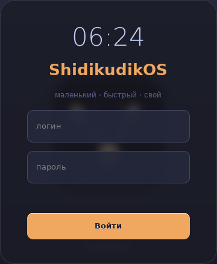
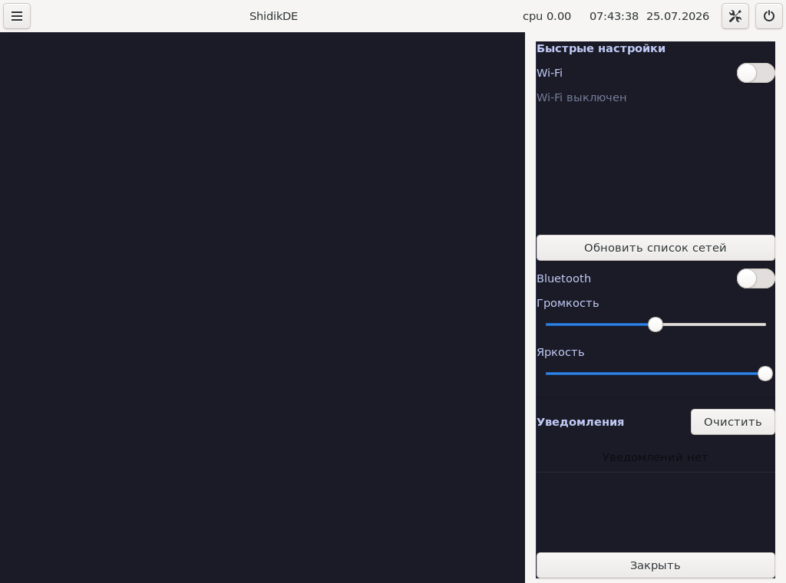
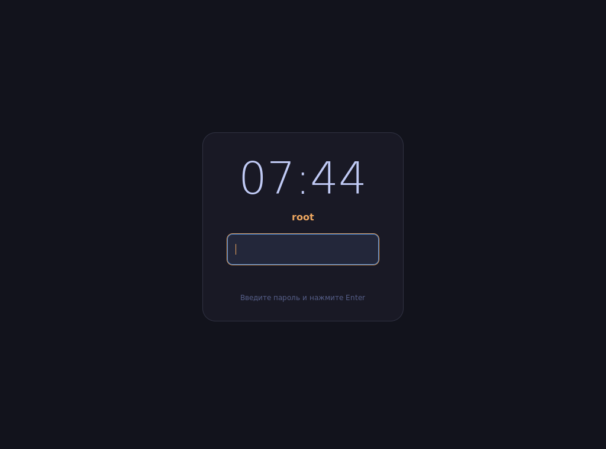
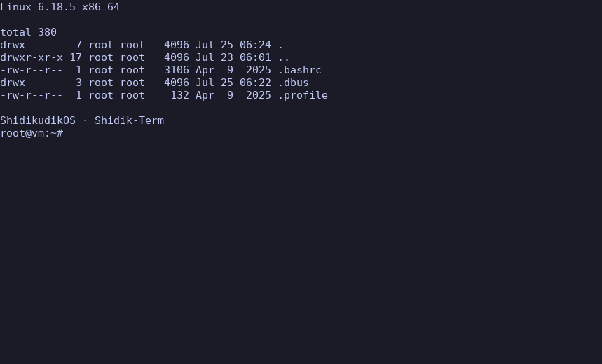
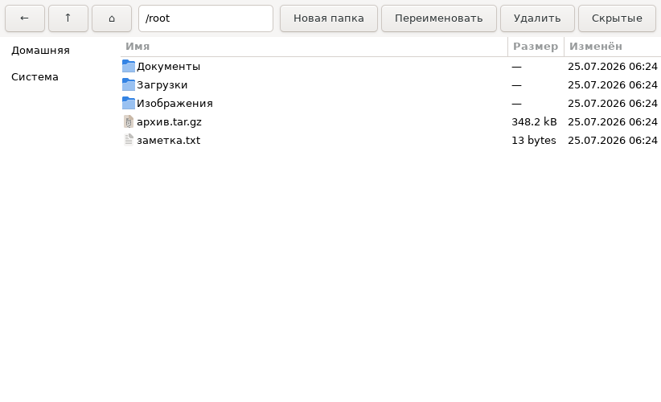
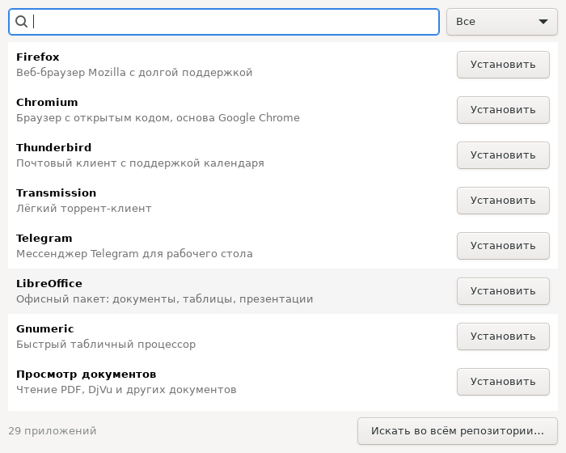
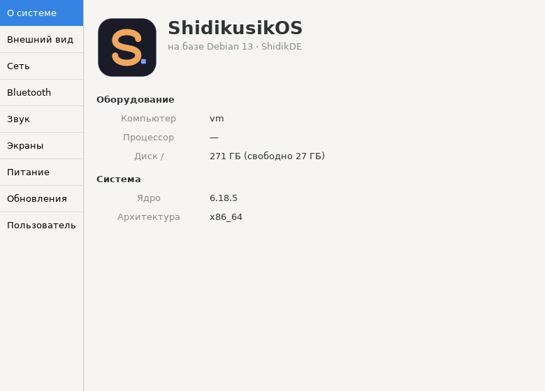
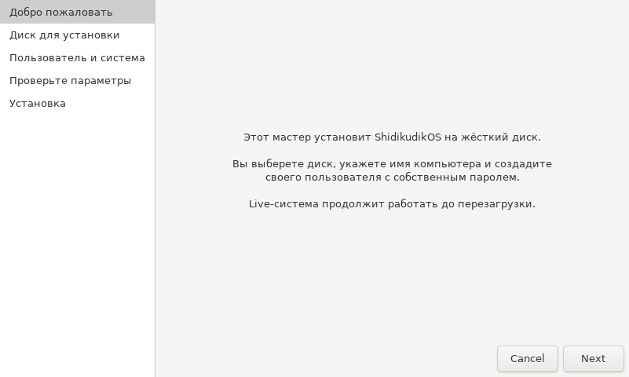

# ShidikusikOS

[Русский](README.md) · **English**


**ShidikusikOS** is an educational, hands-on Debian-based Linux distribution
with its own Display Manager (**ShidikDM**) and Desktop Environment
(**ShidikDE**), both written from scratch.

📀 **[Download a ready-made ISO →](https://github.com/shidikusik/ShidikusikOS/releases)**
— the live session **logs in without a password**; installing to disk
takes one click.

```
   ██████╗
   ██╔═══╝
   ╚█████╗     ShidikusikOS
    ╚═══██╗    small · fast · yours
   ██████╔╝
   ╚═════╝
```

---

## Screenshots

### Login and desktop

| Login screen (shidikgreet) | Desktop (ShidikDE) | App menu (Win+D) |
|---|---|---|
|  |  |  |
| blurred wallpaper, clock, login card | panel: menu, clock, load, power | search across `.desktop` files |

### Shade and lock screen

| Notification & quick-settings shade (Win+N) | Lock screen (Win+L) |
|---|---|
|  |  |
| Wi-Fi with network list, Bluetooth, volume, brightness, notification history | clock, user, PAM password check |

### Our own applications

| Shidik-Term | Shidik-Files |
|---|---|
|  |  |
| terminal in the branded palette (Win+Enter) | places, sizes, file types, trash |

| Shidik-Store | Shidik-Control |
|---|---|
|  |  |
| curated catalog, one-click install | 9 sections: system, theme, network, Bluetooth, sound, displays, power, updates, user |

### Installing to disk



A five-step wizard: disk → user and password → confirmation → install with
progress. A console variant is also available — `sudo shidik-install`
([text-mode login screenshot](assets/screenshots/shidikdm-login.png) — the
fallback ShidikDM greeter if graphics fail).

---

## 1. Overview

| Parameter           | Value                                                |
|---------------------|------------------------------------------------------|
| Base                | Debian 13 "trixie" (stable), kernel Linux 6.12 LTS   |
| Package manager     | `apt` / `dpkg`                                       |
| Init system         | `systemd` (+ `systemd-logind` for sessions & power)  |
| Graphics stack      | **Wayland** via **wlroots 0.18**                     |
| Display Manager     | **ShidikDM** — C, PAM, console greeter               |
| Desktop Environment | **ShidikDE** — compositor + panel + launcher + session |
| ISO build           | `live-build` (uses `debootstrap` under the hood)     |

### Why Wayland/wlroots instead of X11

Building a new DE on X11 in 2026 is a dead end: the X.Org server is
effectively frozen, and a "window manager on top of Xlib/xcb" inherits the
whole legacy model (separate X server, compositor bolted on top, insecure
global input). The Wayland path with **wlroots** gives us:

- **One program = the whole stack.** A wlroots compositor is the display
  server, the window manager and the compositor at once. Fewer moving parts.
- **~50,000 lines of ready-made infrastructure**: DRM/KMS output, libinput,
  hardware rendering, protocol implementations — while the window policy
  remains entirely ours (proven by Sway, Hyprland, river, labwc).
- **Security**: clients can't see each other's input or windows.
- **Debian trixie already ships** `libwlroots-0.18-dev` — we build with the
  stock toolchain, no third-party repos.

The price: X11 apps need XWayland (included in the ISO), and the panel
needs the layer-shell protocol. The whole industry has accepted that price.

---

## 2. Repository layout

```
ShidikusikOS/
├── README.md / README.en.md   ← this file (RU/EN)
├── Makefile                   ← build/install all components
├── assets/                    ← logo, screenshots
├── src/
│   ├── shidikdm/              ← Display Manager (C + PAM)
│   │   ├── main.c             ← greeter: banner, login/password, main loop
│   │   ├── auth.c / auth.h    ← PAM: authentication, session opening
│   │   ├── session.c/.h       ← fork, privilege drop, exec the DE
│   │   └── shidikdm.pam       ← /etc/pam.d/shidikdm
│   ├── shidikwm/              ← Wayland compositor (C + wlroots 0.18)
│   ├── shidikpanel/           ← panel (C + GTK3 + gtk-layer-shell)
│   ├── shidiklaunch/          ← app menu (.desktop, C + GTK3)
│   ├── shidiksession/         ← shidik-session-ctl (C + sd-bus/logind)
│   ├── shidikgreet/           ← graphical DM greeter (glassmorphism)
│   ├── shidikterm/            ← Shidik-Term: terminal (GTK3 + VTE)
│   ├── shidikcontrol/         ← Shidik-Control: settings center
│   ├── shidikfiles/           ← Shidik-Files: file manager
│   └── shidikstore/           ← Shidik-Store: app store (apt)
├── protocols/                 ← layer-shell XML (vendored, MIT)
├── installer/                 ← disk installer + GtkAssistant GUI
├── session/                   ← session entry point, autostart, .desktop
├── systemd/                   ← shidikdm.service (autostart on tty1)
├── iso/                       ← live-build configuration + build.sh
├── .github/workflows/         ← CI: ISO build & GitHub Release publishing
└── docs/                      ← step-by-step ISO build guide
```

---

## 3. ShidikDM — Display Manager

A minimalist console greeter in the spirit of `greetd`/`ly` (~450 lines of
C; the only dependency is `libpam`).

### Architecture

```
systemd (graphical.target)
   └── shidikdm.service  (tty1, root)
        └── shidikdm ──── main.c: greeter loop
             ├── auth.c:    pam_start → pam_authenticate → pam_acct_mgmt
             │              pam_open_session  ← pam_systemd registers the
             │                                  session with logind and
             │                                  creates XDG_RUNTIME_DIR
             └── session.c: fork →
                   [child] setsid → initgroups/setgid/setuid →
                           env from pam_getenvlist →
                           exec $SHELL -l -c shidikde-session
                   [parent, root] waitpid → pam_close_session → greeter again
```

Key decisions:

- **The PAM conversation** (`sdm_conv` in `auth.c`): the password is
  collected by the UI layer up front and handed to PAM on
  `PAM_PROMPT_ECHO_OFF` — UI and auth are fully decoupled, so the console
  greeter can be swapped for a graphical one (SDL2/Raylib/GTK) without
  touching the auth/session code.
- **`pam_systemd` is mandatory** (pulled in via Debian's `common-session`):
  without it there is no `XDG_RUNTIME_DIR`, and a wlroots compositor won't
  start or get DRM/input access through logind.
- Privileges are dropped **only in the child**, strictly in the order
  `initgroups → setgid → setuid`; the root DM process stays alive to close
  the PAM session properly and show the greeter again.
- Brute-force protection: 3 attempts + `sleep(1)`; the password is wiped
  with `explicit_bzero`.

Build: `make -C src/shidikdm` (requires `libpam0g-dev`).

## 4. ShidikDE — Desktop Environment

Modular architecture: four independent processes tied together by Wayland
protocols and D-Bus — any component can be replaced without touching the
rest.

```
shidikde-session (shell)
 └── dbus-run-session
      └── shidikwm  ← compositor: the CORE. Owns the screen and input
           │           (WAYLAND_DISPLAY=wayland-0)
           └── shidikde-autostart
                ├── shidikpanel   ← Wayland client (layer-shell)
                ├── shidiklaunch  ← on demand (☰ or Win+D)
                └── shidik-session-ctl ← invoked by the power buttons
                        └── D-Bus → systemd-logind (PowerOff/Reboot/...)
```

### 4.1 shidikwm — compositor (`src/shidikwm/main.c`)

A skeleton based on tinywl (CC0) targeting **wlroots 0.18**. Implemented:

- multi-monitor output: `wlr_output_layout` + the `wlr_scene` scene graph
  (rendering and damage tracking for free);
- `xdg-shell` windows: map/unmap, click-to-focus, raise, interactive move
  and resize, popups, fullscreen; new windows open centered (cascaded);
- **layer-shell** (`wlr_layer_shell_v1`): the panel is a real edge bar
  with an exclusive zone rather than an ordinary window. The scene is
  split into background / bottom / windows / top / overlay layers, so
  application windows never cover the panel. The protocol XML isn't
  shipped by any distro package and lives in `protocols/` (MIT, from the
  wlroots project); the header is generated by `wayland-scanner`;
- input: keyboard via `xkbcommon` (layout from `XKB_DEFAULT_LAYOUT`),
  cursor via `wlr_cursor` + `xcursor`;
- hotkeys (Win/Super is the modifier): `Win+Enter` — terminal,
  `Win+D` — app menu, `Win+N` — shade, `Win+L` — lock, `Win+Tab` — cycle
  windows, `Win+Q` — close window, `Win+T` — toggle tiling,
  `Win+[` / `Win+]` — master width, `Win+Esc` — end the session;
- **tiling** (Win+T): master/stack layout — the first window takes the
  left half, the rest share the right one. Windows never overlap each
  other or slide under the panel;
- `-s <cmd>` — the autostart script receives a ready `WAYLAND_DISPLAY`.

Growth points marked in the code: `wlr_foreign_toplevel_manager_v1`
(window list in the panel), XWayland, workspaces.

### 4.2 shidikpanel — panel (`src/shidikpanel/panel.c`)

GTK3 + `gtk-layer-shell`: a bar pinned to the top edge with an exclusive
zone. Shows a clock (1 s refresh), load average from `/proc/loadavg`,
battery charge from `/sys/class/power_supply`, a "☰" menu button and a "⏻"
power menu (Logout/Reboot/Poweroff/Suspend → `shidik-session-ctl`). The
window list is a stub with the `wlr-foreign-toplevel-management-v1`
integration plan described in a comment.

### 4.3 shidiklaunch — app menu (`src/shidiklaunch/launcher.c`)

Scans `.desktop` files (`/usr/share/applications`,
`~/.local/share/applications`) via `GKeyFile`, honours
`NoDisplay`/`Hidden`, localized `Name`/`Comment`, strips `%f %u …` field
codes from `Exec`. GTK window: search + list, Enter launches the first
match, Esc closes.

### 4.4 shidik-session-ctl — session manager (`src/shidiksession/`)

A thin `systemd-logind` D-Bus client (sd-bus from libsystemd):
`poweroff`/`reboot`/`suspend` call `Manager.PowerOff` etc. (polkit checks
permissions, no root needed); `logout` calls `TerminateSession("")`:
logind kills every process of the session, the compositor goes down, and
ShidikDM shows the login screen again.

### 4.5 Shidik-Files and Shidik-Store

**Shidik-Files** (`src/shidikfiles/`) — a GTK3 + GIO file manager:
navigation with history, a places sidebar, system icons per file type,
opening files via `GAppInfo`, create folder, rename, move to trash
(`g_file_trash`), show hidden files.

**Shidik-Store** (`src/shidikstore/`) — an app store, a storefront over
`apt`. The catalog is a plain ini file at
`/usr/share/shidikusik/store-catalog.ini` (29 apps: browsers, office,
graphics, multimedia, development, games, system tools) and can be
extended by hand. Package status comes from `dpkg-query`; install and
remove run `pkexec apt-get -y install|remove` with a live log, and
"search the whole repository" opens `apt-cache search` in the terminal.

### Building the whole DE

```sh
sudo apt install gcc make pkg-config libpam0g-dev libwlroots-0.18-dev \
    libwayland-dev libxkbcommon-dev wayland-protocols libgtk-3-dev \
    libgtk-layer-shell-dev libsystemd-dev libvte-2.91-dev
make            # build everything
sudo make install
sudo systemctl enable shidikdm   # DM autostart
```

Quick test without installing: `shidikwm` runs nested inside any running
Wayland/X11 session (wlroots picks the nested backend automatically).

---

## 5. Building the ISO

Full guide: [`docs/iso-build.md`](docs/iso-build.md) (in Russian). In short:

```sh
sudo apt install live-build
cd iso
sudo ./build.sh          # → live-image-amd64.hybrid.iso
```

`build.sh` copies the sources into the image, `lb build` bootstraps Debian
via debootstrap, a chroot hook compiles ShidikDM/ShidikDE right inside the
future system and enables `shidikdm.service`, then everything is packed
into a bootable hybrid ISO (BIOS+UEFI, `dd`-able to a USB stick).

Ready-made ISOs are published to GitHub Releases automatically:
`.github/workflows/release-iso.yml` builds the image in a `debian:trixie`
container on every `v*` tag push (or manually via workflow_dispatch) and
attaches it to a release together with a sha256 checksum.

Testing in QEMU:

```sh
qemu-system-x86_64 -enable-kvm -m 4G -cdrom iso/live-image-amd64.hybrid.iso
```

---

## 6. Live mode and installation

### Live session: no password

The ISO boots **straight to the desktop, without asking for a password**:

- the chroot hook writes `/etc/shidikusik/autologin` containing `shidik`;
- at startup ShidikDM sees that file and logs the user in through the
  `shidikdm-autologin` PAM service, where the `auth` stage is replaced
  with `pam_permit` (the session is still complete: `pam_systemd`,
  logind, `XDG_RUNTIME_DIR`);
- autologin fires **once** — after "Log out" the normal login screen
  appears, otherwise logging out would be impossible;
- live mode also enables passwordless `sudo` and a polkit rule so the
  installer and the app store don't ask for a password that doesn't exist.

All three files are **removed by the installer** — an installed system
asks for a password as usual.

### Installer

The graphical `shidik-install-gui` wizard ("Install ShidikusikOS" in the
app menu) on top of the `installer/shidik-install` engine:

1. target disk selection with an explicit confirmation (the disk is wiped
   entirely);
2. GPT partitioning for UEFI (ESP + ext4) or BIOS (bios_grub + ext4) —
   the mode is detected automatically;
3. copying the running live system with `rsync`;
4. **the user chooses** the hostname, time zone, login and password
   (root is locked; admin via sudo);
5. fstab by UUID, GRUB for the right boot mode, fresh initramfs;
6. removal of the live plumbing: autologin, passwordless sudo/polkit,
   live-boot/live-config and the `shidik` user itself.

The engine also works on its own — `sudo shidik-install` asks the same
questions in the console, and `--unattended` makes installs scriptable:

```sh
echo 'my-password' | sudo shidik-install --unattended \
    --disk /dev/sda --user ivan --hostname mypc --timezone Europe/Moscow \
    --password-stdin
```

## 7. Roadmap

- [x] layer-shell in shidikwm — the panel is a real edge bar
- [x] passwordless autologin in live mode
- [x] graphical installer (GtkAssistant wizard)
- [x] Shidik-Store app store (an apt storefront)
- [x] disk installer (shidik-install)
- [x] graphical ShidikDM greeter (shidikgreet: glassmorphism, dedicated
      compositor via seatd-launch, root-side auth over a socket)
- [x] our own terminal Shidik-Term (GTK3 + VTE, branded palette)
- [x] Shidik-Control settings center (theme, network, displays, user)
- [x] dark theme by default, wallpapers, branding in /usr/share/shidikusik
- [x] Shidik-Files: file manager (GTK3 + GIO: navigation, places, trash,
      rename, open-with-default)
- [ ] foreign-toplevel → window list in the panel (taskbar)
- [ ] workspaces and a tiling mode
- [ ] packaging the components as .deb (debhelper) instead of the build hook
- [ ] our own apt repository (reprepro/aptly)
- [ ] branding: plymouth theme, wallpapers, GRUB menu

## License

Code — MIT; `src/shidikwm/main.c` is based on tinywl (CC0) from the
wlroots project.
