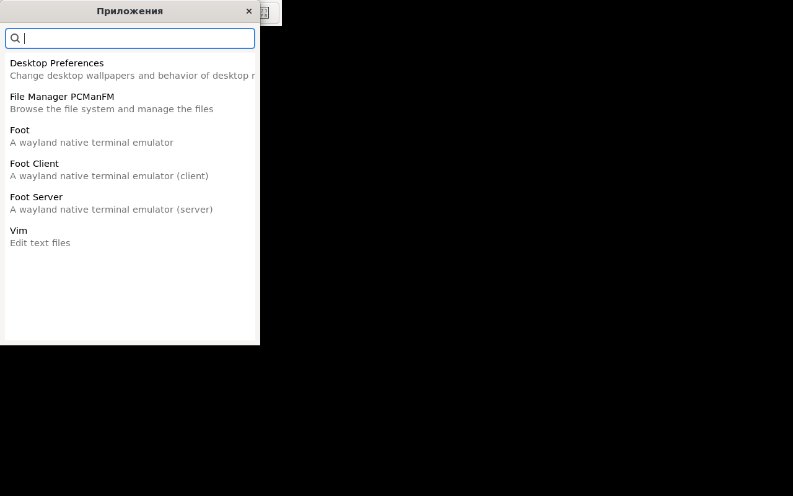

# ShidikudikOS

[Русский](README.md) · **English**


**ShidikudikOS** is an educational, hands-on Debian-based Linux distribution
with its own Display Manager (**ShidikDM**) and Desktop Environment
(**ShidikDE**), both written from scratch.

📀 **[Download a ready-made ISO →](https://github.com/shidikusik/ShidikudikOS/releases)**
(live session login: `shidik` / `live`)

The mascot is the **dik-dik**: a miniature antelope. Small, fast,
unassuming and resilient — just like the distro itself. Logo:
`assets/logo.svg`.

```
      \ /       \ /
      (\)  ___  (/)
       \\ /o o\ //
        (   v   )        ShidikudikOS
         \ \_/ /         small · fast · yours
          '---'
```

---

## Screenshots

Captured in QEMU during the first successful build — from the login
screen to the application menu:

| Login screen (ShidikDM) | Desktop (ShidikDE) | Application menu |
|---|---|---|
|  |  |  |
| ASCII dik-dik and console greeter on tty1 | panel: menu, clock, load average, power button | Win+D: search across .desktop files |

---

## 1. Overview

| Parameter           | Value                                                |
|---------------------|------------------------------------------------------|
| Base                | Debian 13 "trixie" (stable), kernel Linux 6.12 LTS   |
| Package manager     | `apt` / `dpkg`                                       |
| Init system         | `systemd` (+ `systemd-logind` for sessions & power)  |
| Graphics stack      | **Wayland** via **wlroots 0.18**                     |
| Display Manager     | **ShidikDM** — C, PAM, console greeter               |
| Desktop Environment | **ShidikDE** — compositor + panel + launcher + session |
| ISO build           | `live-build` (uses `debootstrap` under the hood)     |

### Why Wayland/wlroots instead of X11

Building a new DE on X11 in 2026 is a dead end: the X.Org server is
effectively frozen, and a "window manager on top of Xlib/xcb" inherits the
whole legacy model (separate X server, compositor bolted on top, insecure
global input). The Wayland path with **wlroots** gives us:

- **One program = the whole stack.** A wlroots compositor is the display
  server, the window manager and the compositor at once. Fewer moving parts.
- **~50,000 lines of ready-made infrastructure**: DRM/KMS output, libinput,
  hardware rendering, protocol implementations — while the window policy
  remains entirely ours (proven by Sway, Hyprland, river, labwc).
- **Security**: clients can't see each other's input or windows.
- **Debian trixie already ships** `libwlroots-0.18-dev` — we build with the
  stock toolchain, no third-party repos.

The price: X11 apps need XWayland (included in the ISO), and the panel
needs the layer-shell protocol. The whole industry has accepted that price.

---

## 2. Repository layout

```
ShidikudikOS/
├── README.md / README.en.md   ← this file (RU/EN)
├── Makefile                   ← build/install all components
├── assets/                    ← logo, screenshots
├── src/
│   ├── shidikdm/              ← Display Manager (C + PAM)
│   │   ├── main.c             ← greeter: banner, login/password, main loop
│   │   ├── auth.c / auth.h    ← PAM: authentication, session opening
│   │   ├── session.c/.h       ← fork, privilege drop, exec the DE
│   │   └── shidikdm.pam       ← /etc/pam.d/shidikdm
│   ├── shidikwm/              ← Wayland compositor (C + wlroots 0.18)
│   ├── shidikpanel/           ← panel (C + GTK3 + gtk-layer-shell)
│   ├── shidiklaunch/          ← app menu (.desktop, C + GTK3)
│   └── shidiksession/         ← shidik-session-ctl (C + sd-bus/logind)
├── installer/                 ← shidik-install: disk installer
├── session/                   ← session entry point, autostart, .desktop
├── systemd/                   ← shidikdm.service (autostart on tty1)
├── iso/                       ← live-build configuration + build.sh
├── .github/workflows/         ← CI: ISO build & GitHub Release publishing
└── docs/                      ← step-by-step ISO build guide
```

---

## 3. ShidikDM — Display Manager

A minimalist console greeter in the spirit of `greetd`/`ly` (~450 lines of
C; the only dependency is `libpam`).

### Architecture

```
systemd (graphical.target)
   └── shidikdm.service  (tty1, root)
        └── shidikdm ──── main.c: greeter loop
             ├── auth.c:    pam_start → pam_authenticate → pam_acct_mgmt
             │              pam_open_session  ← pam_systemd registers the
             │                                  session with logind and
             │                                  creates XDG_RUNTIME_DIR
             └── session.c: fork →
                   [child] setsid → initgroups/setgid/setuid →
                           env from pam_getenvlist →
                           exec $SHELL -l -c shidikde-session
                   [parent, root] waitpid → pam_close_session → greeter again
```

Key decisions:

- **The PAM conversation** (`sdm_conv` in `auth.c`): the password is
  collected by the UI layer up front and handed to PAM on
  `PAM_PROMPT_ECHO_OFF` — UI and auth are fully decoupled, so the console
  greeter can be swapped for a graphical one (SDL2/Raylib/GTK) without
  touching the auth/session code.
- **`pam_systemd` is mandatory** (pulled in via Debian's `common-session`):
  without it there is no `XDG_RUNTIME_DIR`, and a wlroots compositor won't
  start or get DRM/input access through logind.
- Privileges are dropped **only in the child**, strictly in the order
  `initgroups → setgid → setuid`; the root DM process stays alive to close
  the PAM session properly and show the greeter again.
- Brute-force protection: 3 attempts + `sleep(1)`; the password is wiped
  with `explicit_bzero`.

Build: `make -C src/shidikdm` (requires `libpam0g-dev`).

## 4. ShidikDE — Desktop Environment

Modular architecture: four independent processes tied together by Wayland
protocols and D-Bus — any component can be replaced without touching the
rest.

```
shidikde-session (shell)
 └── dbus-run-session
      └── shidikwm  ← compositor: the CORE. Owns the screen and input
           │           (WAYLAND_DISPLAY=wayland-0)
           └── shidikde-autostart
                ├── shidikpanel   ← Wayland client (layer-shell)
                ├── shidiklaunch  ← on demand (☰ or Win+D)
                └── shidik-session-ctl ← invoked by the power buttons
                        └── D-Bus → systemd-logind (PowerOff/Reboot/...)
```

### 4.1 shidikwm — compositor (`src/shidikwm/main.c`)

A skeleton based on tinywl (CC0) targeting **wlroots 0.18**. Implemented:

- multi-monitor output: `wlr_output_layout` + the `wlr_scene` scene graph
  (rendering and damage tracking for free);
- `xdg-shell` windows: map/unmap, click-to-focus, raise, interactive move
  and resize, popups;
- input: keyboard via `xkbcommon` (layout from `XKB_DEFAULT_LAYOUT`),
  cursor via `wlr_cursor` + `xcursor`;
- hotkeys (Win/Super is the modifier): `Win+Enter` — terminal (foot),
  `Win+D` — launcher, `Win+Tab` — cycle windows, `Win+Q` — close window,
  `Win+Esc` — end the session;
- `-s <cmd>` — the autostart script receives a ready `WAYLAND_DISPLAY`.

Growth points marked in the code: `wlr_layer_shell_v1` (panel above
windows), `wlr_foreign_toplevel_manager_v1` (taskbar), XWayland,
workspaces.

### 4.2 shidikpanel — panel (`src/shidikpanel/panel.c`)

GTK3 + `gtk-layer-shell`: a bar pinned to the top edge with an exclusive
zone. Shows a clock (1 s refresh), load average from `/proc/loadavg`,
battery charge from `/sys/class/power_supply`, a "☰" menu button and a "⏻"
power menu (Logout/Reboot/Poweroff/Suspend → `shidik-session-ctl`). The
window list is a stub with the `wlr-foreign-toplevel-management-v1`
integration plan described in a comment.

### 4.3 shidiklaunch — app menu (`src/shidiklaunch/launcher.c`)

Scans `.desktop` files (`/usr/share/applications`,
`~/.local/share/applications`) via `GKeyFile`, honours
`NoDisplay`/`Hidden`, localized `Name`/`Comment`, strips `%f %u …` field
codes from `Exec`. GTK window: search + list, Enter launches the first
match, Esc closes.

### 4.4 shidik-session-ctl — session manager (`src/shidiksession/`)

A thin `systemd-logind` D-Bus client (sd-bus from libsystemd):
`poweroff`/`reboot`/`suspend` call `Manager.PowerOff` etc. (polkit checks
permissions, no root needed); `logout` calls `TerminateSession("")`:
logind kills every process of the session, the compositor goes down, and
ShidikDM shows the login screen again.

### Building the whole DE

```sh
sudo apt install gcc make pkg-config libpam0g-dev libwlroots-0.18-dev \
    libwayland-dev libxkbcommon-dev wayland-protocols libgtk-3-dev \
    libgtk-layer-shell-dev libsystemd-dev
make            # build everything
sudo make install
sudo systemctl enable shidikdm   # DM autostart
```

Quick test without installing: `shidikwm` runs nested inside any running
Wayland/X11 session (wlroots picks the nested backend automatically).

---

## 5. Building the ISO

Full guide: [`docs/iso-build.md`](docs/iso-build.md) (in Russian). In short:

```sh
sudo apt install live-build
cd iso
sudo ./build.sh          # → live-image-amd64.hybrid.iso
```

`build.sh` copies the sources into the image, `lb build` bootstraps Debian
via debootstrap, a chroot hook compiles ShidikDM/ShidikDE right inside the
future system and enables `shidikdm.service`, then everything is packed
into a bootable hybrid ISO (BIOS+UEFI, `dd`-able to a USB stick).

Ready-made ISOs are published to GitHub Releases automatically:
`.github/workflows/release-iso.yml` builds the image in a `debian:trixie`
container on every `v*` tag push (or manually via workflow_dispatch) and
attaches it to a release together with a sha256 checksum.

Testing in QEMU:

```sh
qemu-system-x86_64 -enable-kvm -m 4G -cdrom iso/live-image-amd64.hybrid.iso
```

---

## 6. Installer

`installer/shidik-install` — our own console installer in the ShidikDM
style (run from the live session: the "Install ShidikudikOS" entry in the
app menu, or `sudo shidik-install` in a terminal):

1. target disk selection with an explicit confirmation (the disk is wiped
   entirely);
2. GPT partitioning for UEFI (ESP + ext4) or BIOS (bios_grub + ext4) —
   the mode is detected automatically;
3. copying the running live system with `rsync`;
4. **the user chooses** the hostname, time zone, login and password
   (root is locked; admin via sudo);
5. fstab by UUID, GRUB for the right boot mode, fresh initramfs;
6. removal of the live plumbing (live-boot/live-config) and the live user.

## 7. Roadmap

- [x] disk installer (shidik-install)
- [ ] layer-shell + foreign-toplevel in shidikwm → a real taskbar
- [ ] graphical ShidikDM greeter (SDL2/GTK4) on top of the existing auth layer
- [ ] workspaces and a tiling mode
- [ ] packaging the components as .deb (debhelper) instead of the build hook
- [ ] our own apt repository (reprepro/aptly)
- [ ] branding: plymouth theme, wallpapers, GRUB menu

## License

Code — MIT; `src/shidikwm/main.c` is based on tinywl (CC0) from the
wlroots project.
